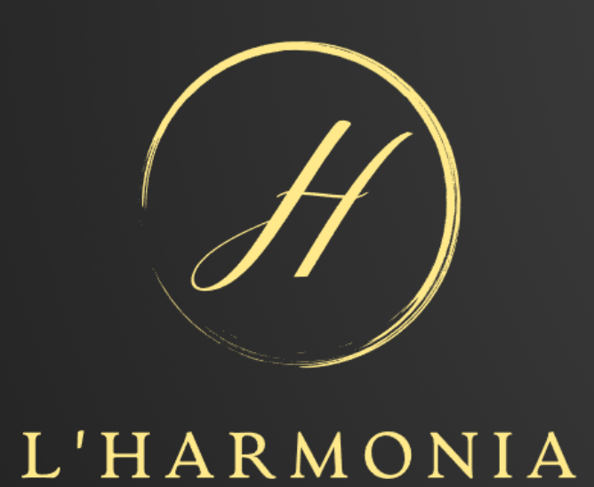

# **Hotel l'Harmonia** 

# **Logo**

 
 
 

# **Ubicación**

Se eligió como ubicación para nuestro hotel una de las zonas más céntricas de Barcelona, Passeig de Grâcia, debido a su gran afluencia de turistas y facilidad para tratos con los diversos comercios que rodean la zona. Nuestro objetivo a la hora de escoger esta zona céntrica, es atraer al mayor número de personas y ofrecerles un servicio alternativo y de calidad, que permitiría cambiar el rumbo del turismo de uno descontrolado a uno más responsable y sensibilizado con el entorno.
 
 
 

# **Clasificación**

L'Harmonia es un hotel, por lo tanto pertenece al **sector terciario** ya que ofrecemos diversos servicios. Somos una empresa de **tamaño mediano**, ya que por ahora tenemos 46 trabajadores, incluyendo el equipo directivo. 

Al recibir diversas subvenciones por parte del Estado, además de financiación por créditos bancarios, nuestro **modelo de capital es mixto**. El **ámbito en el que ejercemos por ahora es local**, centrándonos en su mayor parte en Barcelona y alrededores, buscando mejorar la situación de nuestra ciudad y ofrecer los servicios más especializados posibles.

Debido a esto, nuestros beneficios, a pesar de ser una **empresa con ánimo de lucro**, estarán en parte destinados a diversas causas medioambientales y de respeto con los diversos espacios urbanos, así como animales callejeros o abandonados. 

La forma jurídica de nuestra empresa es **cooperativa**, dos directivos comparten tanto las responsabilidades como la toma de decisiones de nuestra empresa.
 
 
 

# **Tipo de cliente**

El público objetivo el cual nos dirigimos, será gente adulta que busque disfrutar del interés cultural de la ciudad de Barcelona. Con posición económica mediana / alta.

 Que busquen un interés por la cultura de este territorio de una forma calmada y relajada. En nuestro hotel aceptamos familias por aquellos interesados por la cultura que la puedan transmitir a las próximas generaciones. Desgraciadamente, no disponemos de las instalaciones necesarias para aceptar animales en nuestro hotel.
 
 
 

# **Areas funcionales:**

- Guías

- Directivos

- RRHH

- Contabilidad

- Servicio

- Marketing

- Cocina

- Logistica

- Mantenimiento

- Seguridad

- IT
 
 
 

# **Estrategia Espresarial**
## **Mission:**
La mission de nuestra empresa es la fomentacion de un turismo sano y de calidad, mediante la sugestion de visitar zonas no tan concurridas de Barcelona con una historia mas desconocida, o la propuesta de visita en horario bajo para las actividades más demandadas, y todo esto fomentado mediante guias personalizadas del hotel.
 
 

## **Vision:**
Transformar nuestro actual hotel en una cadena de hoteles repartidos por toda Esapaña i/o Europa en las ciudades mas visitadas, dando a conocer su lado mas desconocido.
 
 

## **Valores:**
Somos un negocio conscienciado con el medio ambiente, por eso nuestros hoteles funcionan con energia 100% verde, tambien tenemos en mente la tranquilidad y el bienestar de los residentes, por eso queremos fomentar un tipo de turismo mas sano y en armonia con los vecinos.
 
 

## **Metas y Objetivos a Corto Plazo:**
La principal meta actual es establecerse como hotel de referencia en Barcelona i obtener beneficios suficientes como para crecer y expandirnos poco a poco hasta llegar a ciudades colindantes, ex. Girona, Tarragona, Lleida hasta llegar a las Comunidades Autonomas cercanas.
 
 

## **Mida de la Empresa:**
Nosotros consideramos que l'Harmonia es una empresa de tamaño medio con un numero de trabajadores cercanos a los 50.
 
 

## **Analisis de Mercado:** 
Nuestros sondeos, y estudios indican que la competitividad en el area hotelera es muy elevada en la zona de Barcelona, por eso ponemos mucho empeño en nuestra principal fortaleza que es la originalidad, con la que esperamos obtener una parte del mercado suficientemente grande como para crecer de forma exponencial.
 
 

## **Como atraer a los clientes:** 
Obiamente tenemos varios planes en marcha para atraer la atención del cliente hacia nuestro hotel, entre ellas esta la organicación de actividades de las que ningun otro hotel disponga, una buena campaña de marketing durante la temporada alta antes de la apertura y unos precios lo suficientemente competitivos para la relacion de calidad/precio que ofrecemos.
 
 
 
 

# **Necesidades de la Empresa**
## **El sistema de reservas**
Primero de todo para nuestro hotel necessitaremos un sistema para gestionar las reservas y la información que viene con ellas tanto del lado cliente, como el nuestro, para ello necessitaremos lo siguiente:

- **Sistema de gestion de usuarios:** La base de datos debera saber quien se ha conectado mediante un usuario y una contraseña para saber que información y opciones dar, por ejemplo queremos mostrar los detalles de la reserva solo a nuestros empleados, y el cliente solo debe saber que la habitación esta disponible (**Icono Verde**) o no (**Icono Naranja**, o **Icono Azul** en caso de sucia).
 
 
- **Tipo de habitación:** Queremos que cuando el usuario vaya a reservar su habitación pueda ver de que tipo es: individual, doble, triple, quadruple o suit. 
Dentro de este apartado deberia verse también como un numero cuanta gente cabe como màximo y cuantas camas y de que tamaño son hay en la habitación.
 
 
- **Habitación Libre o Ocupada:** Obiamente queremos saber la disponibilidad de las habitaciónes, para el cliente solo debera salir la disponibilidad dependiendo de la fecha, pero para los usuarios del hotel debera salir la siguiente informacion:

    - Nombre de la persona que reserva.
    - Cuando empieza y termina la estancia.
    - Hora del Check-in y Check-out.
    - Cual es la planta y numero de la habitación reservada.
    - Para cuantas personas es la reserva.
 
 
- **Detección del estado de la habitación:** Por ultimo queremos que el sistema detecte si la habitación esta limpia o sucia a partir del sistema de limpieza que explicaremos a continuación, en caso de estar sucia no permitira que haya reservas en esa habitación hasta X horas despues, es decir el cliente podra hacer la reserva en esa habitación pero solo podra ocupar-la a partir de la hora X en la que se supone estara limpia. 
 
 
 

## **Sistema de limpieza**
La función principal del sistema de limpieza sera saber que habitaciónes necessitan limpieza y cuales estan limpias, aunque también se utilizara para llevar un seguimiento de los objetos perdidos, e un inventario de los productos que se necessitan para mantener las habitaciónes limpias:

- **Habitación limpia o sucia:** El sistema debera tener una interfície grafica similar a la de las reservas pero que indique que habitaciónes se encuentran sucias, siendo estas las que recientemente a abandonado un cliente, o que un cliente/superior a pedido que se limpie. El sistema también debera llevar la cuenta de tiempo desde que se limpio la habitación por ultima vez. Por ultimo se debera saber que grado de suciedad tiene la habitación que se vaya a limpiar, por ejemplo: Una habitación que lleva 1 semana sin limpiar y sin ocupar es una limpieza ligera(quitar el polvo), una habitación que acaba de ser liberada seria una limpieza media(limpiar sabanas, baños, reponer lo necessarió), cuando haya algun accidente que requiera unos productos mas fuertes se marcara como limpieza a fondo.
 
 
- **Inventario:** Como necesitaremos productos para limpiar las habitaciónes habra que llevar un inventario para saber cuando debemos reponer el stock, en caso de ser productos que se reutilizan deberemos saber la disponibilidad de ellos. Los productos que deberan haber en este inventario són:
 
    - Bolsas de basura
    - Toallas
    - Sabanas
    - Jabon
    - Legia
    - Amoniaco
    - Desengrasante
    - Limpiacristales
    - Desincrustantes
    - Gel hidroalchólico
    - Papel Higienico
    - Trapos
    - Escoba
    - Fregona
    - Funda almohadas
 
 
- **Reportar Objetos Perdidos:** Debido a que el personal de limpieza es el mas propenso a encontrar objetos que el cliente se ha dejado queremos una aplicación para que puedan reportarlo, tienen que poder:

    - Escribir el nombre y una brebe descripción del objeto que han encontrado.
    - Poder incluir una foto de este.
    - Añadir el piso, habitación, dia y hora en el que lo encontraron.
    - La app debe registrar que usuario/persona introduce los datos y cuando.
 
 
 

## **Pagina Web**  
Queremos que se diseñe una pàgina web con estilo lujoso y que transmita calma al usuario, debera contener la siguiente información:

- **Pagina principal:** Aqui habra una brebe descripción sobre nuestro Hotel, la Ubicación de este, saldra tambien nuestro resumen de Valores, Responsabilidad Social Corporativa y varias imagienes del Hotel y sus trabajadores,también habra un menu desde el cual podremos acceder a las otras ventanas de la pàgina web, finalmente abajo del todo saldra toda la información legal pertinente(constante en todas las paginas).

- **Formulario de Contacto:** Queremos que en la pagina se incluya un formulario de contacto en una pestaña diferente para que la gente nos pregunte cualquier duda.

- **Reseñas y comentarios:** La reseña y comentarios también estara en una ventana aparte, y como indica permitira a los usuarios registrados dejar una puntuacion en estrellas de 1 a 5, y un comentario de texto libre.

- **Sistema de reservas:** Otra ventana sera el front end del **sistema de reservas**, queremos que sea una simulación de un piso donde en la parte derecha podras seleccionar en cual estas(1-5), y te salgan las habitaciónes (20 por piso, con todos los detalles que se explican en el **sistema de reserva** en un desplegable) donde saldra si estan disponibles o no (por la conexion a la BBDD del **sistema de reservas**) y si clickas en una disponible te permitira reservarla, donde te llevara a otra pagina que te pedira los datos y los guardara en la BBDD del **sistema de reservas**.

- **Calendario de Actividades y Eventos:** La ultima ventana de nuestra pàgina web queremos que sea un calendario donde se anuncien los eventos/actividades que ofrece el hotel (los usuarios de los trabajadores de IT del hotel deberian poder añadir o quitar eventos/actividades), el desplegable debera tener la siguiente información:

    - **Información del Evento:** Basicamente en que consistira el evento/actividad.
    - **Guia:** Quien sera el guia.
    - **Dia y Hora:** Que dia y hora empieza.
    - **Duración del Evento:** Cuanto dura en horas.
    - **Precio y Ofertas:** Cuanto vale y si hay alguna oferta aplicada.
    - **Itinerario:** Por donde se ira.
 
 
 

# **Número de empleados y su rol**

## **Directivos (2)**
Los directivos supervisan las operaciones generales del hotel y toman decisiones estratégicas para el negocio.
 
 

## **Servicio (20)**
Este grupo incluye personal de recepción, conserjería, personal de limpieza y otros que se ocupan de brindar servicios directos a los huéspedes. 

- Recepcionista Principal:
Atender a los huéspedes en el mostrador de recepción.
Gestionar el proceso de registro de entrada y salida.
Proporcionar información sobre servicios y comodidades del hotel.
Manejar reservas y consultas telefónicas.

- Conserje:
Ayudar a los huéspedes con solicitudes especiales, como reservas en restaurantes, entradas a espectáculos o traslados.
Proporcionar información turística y recomendaciones locales.

- Botones y maleteros:
Ayudar a los huéspedes con el transporte de su equipaje.
Asegurarse de que los vehículos de los huéspedes se estacionen adecuadamente.

- Personal de limpieza:
Limpiar y mantener las habitaciones de los huéspedes.
Cambiar las sábanas y mantas y reponer los artículos de las habitaciones.
 
 

## **Mantenimiento (2)**

Personal de mantenimiento que se encarga de asegurar que las instalaciones y equipos estén en buen estado y funcionamiento.
 
 

##  **Guías (6)**

Guías turísticos que se encargan de llevar a los huéspedes a las actividades turísticas planificadas y proporcionar información sobre la ciudad.
 
 

## **Cocina (7)**

Personal de cocina que prepara alimentos y bebidas para los huéspedes, incluyendo chefs, cocineros y personal de servicio en el restaurante.

- Camarero/a de Restaurante:
Tomar pedidos y servir alimentos y bebidas a los huéspedes en el restaurante. Garantizar una experiencia gastronómica positiva.

- Chef Principal:
Supervisar la cocina y elaborar el menú.
Coordinar el personal de cocina y garantizar la calidad de los platos.

 - Personal de Cocina: Cocineros y asistentes de cocina que preparan alimentos según las recetas del chef.
Mantener la higiene y seguridad alimentaria en la cocina.
 
 

## **Contabilidad (2)**
Los profesionales de contabilidad se encargan de administrar las finanzas del hotel, incluyendo la contabilidad y la gestión de costes.
 
 

## **Recursos Humanos (2)**
Administrar la contratación, capacitación y gestión del personal.
Manejar asuntos relacionados con los empleados, como nóminas y beneficios.
 
 

## **Marketing (2)**
El equipo de marketing se encarga de diseñar estrategias de marketing, promociones y publicidad para atraer clientes.
 
 

## **Tecnología de la Información (IT) (3)**
 Profesionales de TI que se encargan de mantener y actualizar la infraestructura tecnológica del hotel, incluyendo sistemas de reservas, gestión de la página web y seguridad informática.
 
 

## **Logística (5)**
Este grupo se ocupa de la gestión de suministros, distribución de productos y mantenimiento de inventario.

