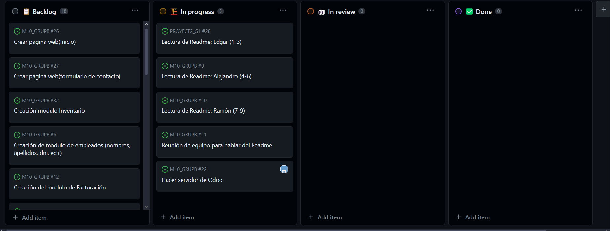
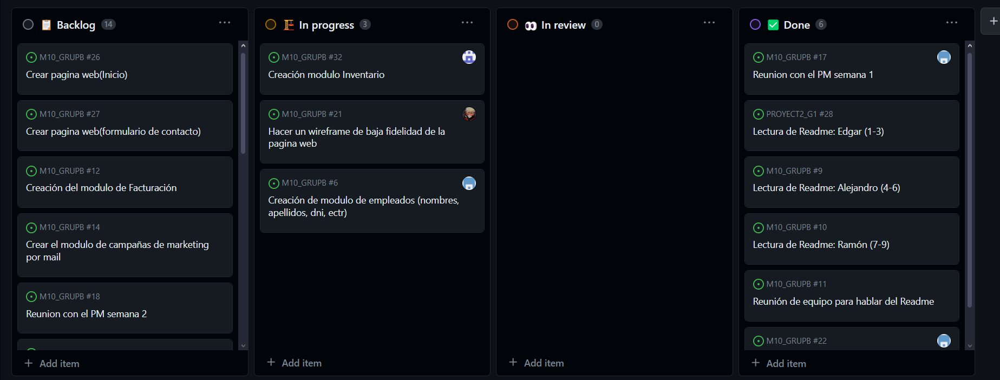
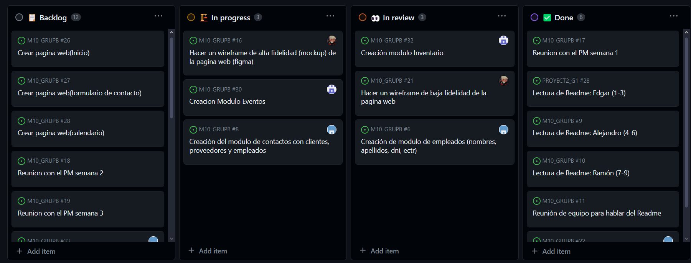
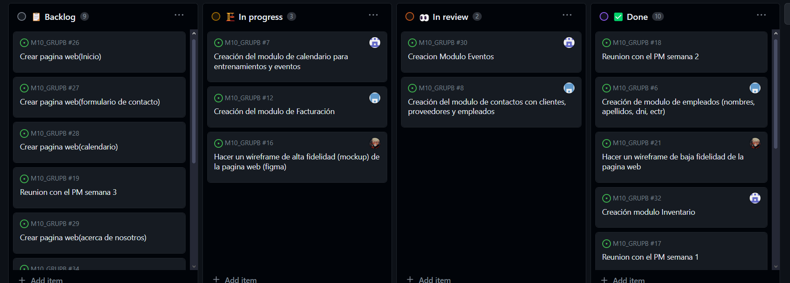
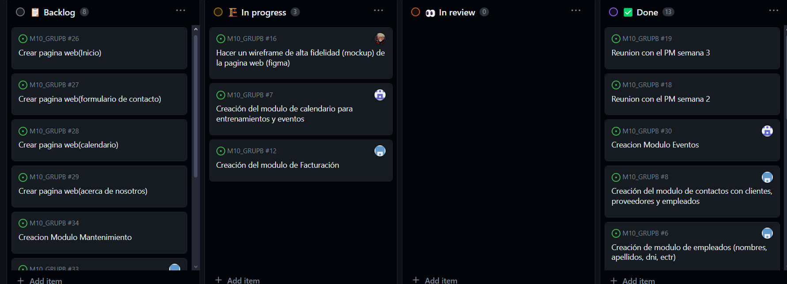
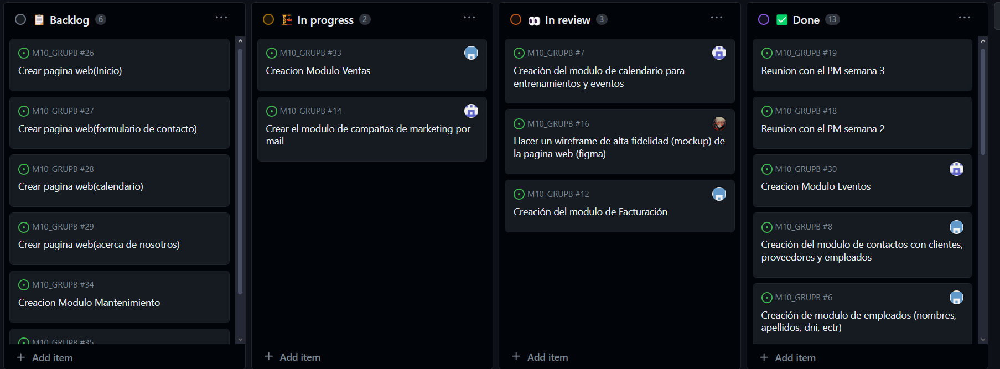
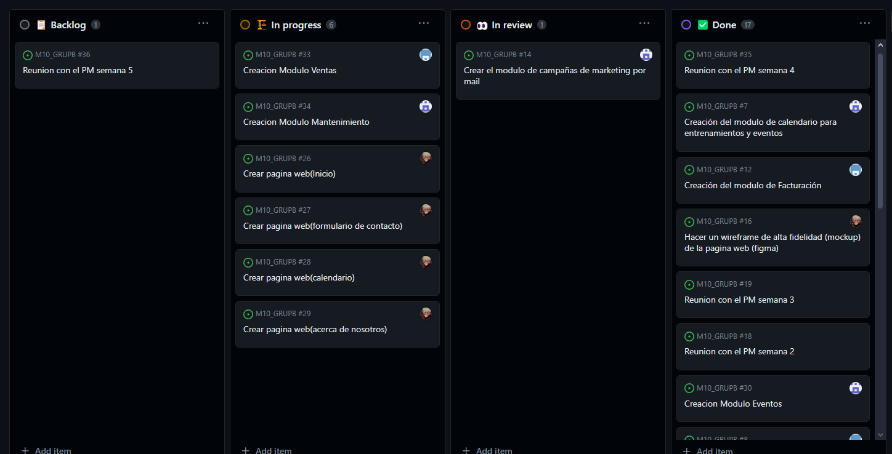
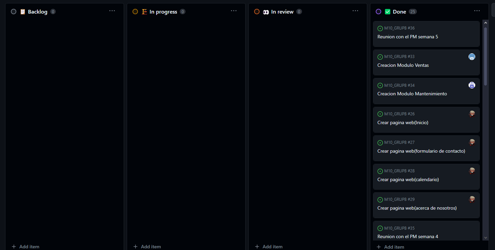

# **README_2** 

# **Sprint Semana 1 Principio**

 

# **Sprint Semana 1 Final**

 

# **Sprint Semana 2 Principio**

 

# **Primera Reunion con el PM Semana 2**

En la primera reunion con el cliente les he explicado que a entendido el equipo de su proyecto y como pensamos que se podria realizar, concretando que modulos de Odoo nos parecen los mas apropiados para acercar-nos a su idea original. El cliente no ha presentado quejas ni a ofrecido otras apps que desee asi que continuamos con el plan inicial.

 

# **Sprint Semana 2 Final**

 

# **Sprint Semana 3 Principio**

 

# **Segunda Reunion con el  PM Semana 3**
Segunda reunion con el PM, le hemos mostrado el inventario y los departamentos, en su mayoria, creados en Odoo para los que no a tenido queja ya que eran exactamente los que habia pedido, para los empleados le hemos enseñado una distribución que creiamos mas apropiada con un departamento extra para los jugadores/entrenadores del equipo. Les ha gustado la idea. Sobre el wireframe a dicho que tengamos enfasis en el espiritu deportivo y la interfaz mas facil de entender, sin mucha publicidad sobre el dinero para no dar imagen de avarosidad.

 

# **Sprint Semana 3 Final**

 

# **Sprint Semana 4 Principio**

 

# **Tercera Reunion con el PM Semana 4**
En esta reunion hemos mostrado el modulo de Eventos y Contactos, les hemos mostrado que eventos habiamos organizado y han estado de acuerdo con ellos, les hemos preguntado si deseaban que pusieramos alguno mas pero no se les a ocurido ninguno. En cuanto a contactos les a gustado que se pueda etiquetarlos para asi poder filtrarlos con mas facilidad.

 

# **Sprint Semana 4 Final**

 

# **Sprint Semana 5 Principio**

# **Quarta Reunion con el PM Semana 5**
La parte principal de esta reunion fue el wireframe de alta fidelidad, el PM nos comento que le gusto que utilizaramos los colores del logo para la pagina, pero que debiamos añadir un sombreado para dar sensacion de profundidad. Acerca del modulo de Facturacion y el Calendario no se pronuncio mucho dando a entender que estaba satisfecho con ello.

 

# **Sprint Semana 5 Final**

 

# **Sprint Semana 6 Principio**

 

# **Quinta Reunion con el PM Semana 6**
Le hemos mostrado el resultado final de la pàgina web al PM y le a gustado mucho, al igual que la campaña de marketing con mail, si que nos a ayudado comentandonos algunas pàginas intermedias como la de agradecimiento cuando nos envian un mail por contactos la cual no teniamos hecha, luego tanto el modulo de mantenimiento como el de ventas le ha parecido que estaban bien hechos.

 

# **Sprint Semana 6 Final**
